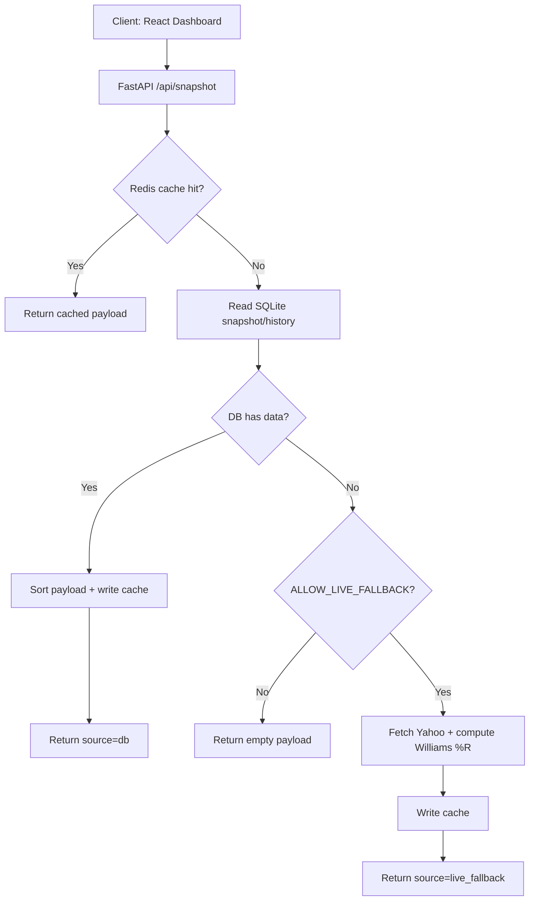
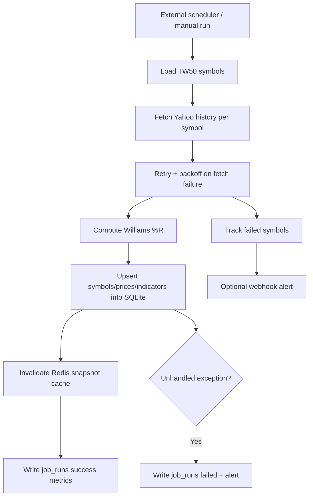

# WillR · Taiwan 50 Williams %R

WillR provides a TW50 Williams %R dashboard and API.

- Frontend: React dashboard (range filters + table + trend chart)
- Backend: FastAPI (`/api/snapshot`)
- Data source: Yahoo Finance

> For research only. Not investment advice.

## Current Product Scope

- Universe is fixed to **TW50** (`tw50_constituents.txt`)
- Two configurable %R ranges on the dashboard (defaults):
  - `-100 ~ -90`
  - `-10 ~ 0`
- Snapshot includes symbol, name, OHLC, volume, day change, and Williams %R
- Click a row to view recent close + %R trend

## Features

- TW50 fixed universe snapshot (`/api/snapshot`)
- Dashboard range filters for Williams %R
- Symbol table with name, OHLC, volume, day change, %R
- Selected symbol trend chart (close + %R)
- DB-first data read with live fallback
- Redis cache for snapshot API (best-effort)
- Daily ingestion job with retry/backoff
- Cache invalidation after ingestion success
- Job run tracking (`job_runs`) and freshness API (`/api/meta`)
- Structured JSON logs and optional webhook alert

## Flow Diagram

### Request Flow (`/api/snapshot`)



### Ingestion Flow (`jobs/daily_ingest.py`)



## Architecture (Phase C)

This repository is being migrated to a product-style architecture.

- `config/`: settings and environment config
- `db/`: SQLite engine and schema
- `repository/`: data access layer
- `services/`: use-case orchestration
- `jobs/`: ingestion jobs (external worker / scheduler)
- `api/`: HTTP layer

Phase tracking document: `docs/ARCHITECTURE_PLAN.md`

## Requirements

- Python 3.9+
- Node.js 18+

## Setup

```bash
python3 -m venv .venv
.venv/bin/pip install -r requirements.txt
```

```bash
cd dashboard
npm install
cd ..
```

## Local Development

### Run API

```bash
PYTHONPATH=. .venv/bin/uvicorn api.main:app --reload --host 127.0.0.1 --port 8000
```

### Run frontend

```bash
cd dashboard
npm run dev
```

Open `http://localhost:5173`.

## API

### `GET /api/health`

Health check.

### `GET /api/snapshot`

Returns TW50 snapshot and recent history.

Current runtime behavior:

- DB-first
- fallback to live Yahoo if DB is empty/unavailable (temporary stability mode)

Query params:

- `period` (default `14`)
- `sort` (`symbol` / `williams_r` / `williams_r_desc`)
- `recent` (default `60`)
- `workers` (default `10`)

Example:

```bash
curl -s "http://127.0.0.1:8000/api/snapshot?period=14&sort=symbol&recent=60"
```

### `GET /api/meta`

Returns data freshness and ingestion status:

- latest trade date for selected period
- latest `daily_ingest` job run status/message
- symbol count

Example:

```bash
curl -s "http://127.0.0.1:8000/api/meta?period=14"
```

## Daily Ingestion Job (Phase B)

Run manually (same command used by external worker):

```bash
PYTHONPATH=. .venv/bin/python jobs/daily_ingest.py
```

This writes into SQLite (`data/willr.db` locally, `/tmp/willr.db` on Vercel runtime).
If DB has no data, `/api/snapshot` can still serve data via live fallback.

### External Worker Scheduling

Use any external scheduler to run `jobs/daily_ingest.py` once daily, e.g.:

- OS cron on a VM/container
- GitHub Actions schedule
- a dedicated worker service

Suggested schedule: market close + buffer (e.g. Asia/Taipei 18:00).

## Cache / Reliability (Phase C)

- `/api/snapshot` uses Redis cache when available.
- `daily_ingest` evicts snapshot cache after successful upsert.
- Ingestion fetch has retry with backoff.
- Structured JSON logs are emitted for snapshot/ingest events.
- Optional webhook alerts can be enabled via `ALERT_WEBHOOK_URL`.

## CLI

```bash
PYTHONPATH=. .venv/bin/python fetch_williams.py --universe tw50 --period 14 --recent 5
```

## Vercel Deploy

Included:

- `vercel.json`
- `scripts/vercel-build.sh` (builds dashboard and copies assets to `api/static`)

Deploy from repo root.

Note: Vercel runtime filesystem is ephemeral (`/tmp` writable). Persistent historical storage should run on a persistent host/DB.

## Project Structure

```text
.
├── api/
├── config/
├── db/
├── repository/
├── services/
├── jobs/
├── dashboard/
├── docs/
├── tw50_constituents.txt
├── fetch_williams.py
├── willr_core.py
├── requirements.txt
└── vercel.json
```
